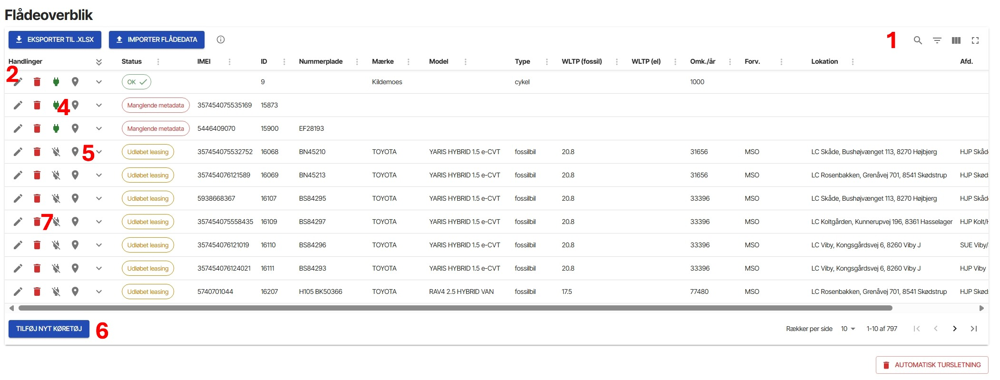
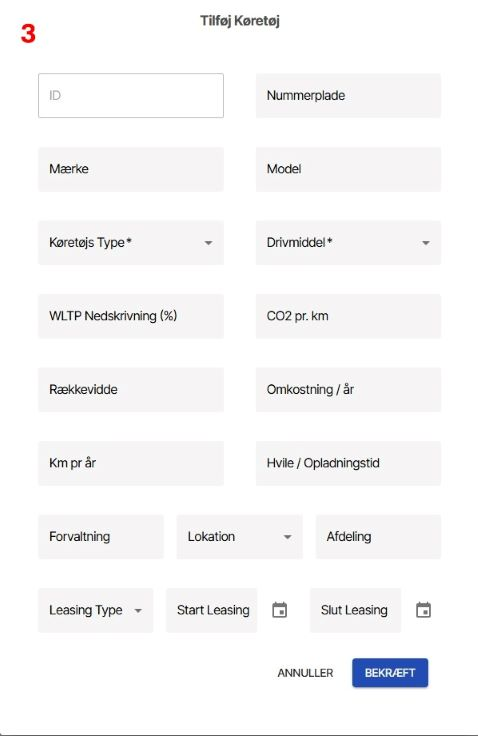

# Køretøjer #
_OBS: Ændringer i konfiguration vil medføre ændringer for samtlige brugere i din organisation_

Her vises et overblik over alle de køretøjer, der er oprettet i FleetOptimiser. Her kan du både finde de køretøjer, der er hentet via integrationen til jeres flådestyringssystem, samt de testkøretøjer I selv har oprettet. Det er også i konfiguration, at I kan udfylde og rette i metadata på køretøjerne, samt flytte et køretøj fra én lokation til en anden. Det er ikke alle flådestyringssystemer, som udstiller metadata på køretøjerne. Derfor kan det være nødvendigt selv at udfylde de manglende data.

### Sådan konfigurerer du et enkelt eller få køretøjer: ###
1. Hvis du vil søge et specifikt køretøj frem, kan du enten åbne søgefeltet ved at klikke på søgeikonet, eller aktivere filterfunktionen ved at klikke på filtreringsknappen
2. Vælg køretøjet du gerne vil redigere ved at klikke på blyantsikonet
3. Indtast de nødvendige metadata i felterne og klik opdater. Du kan se en oversigt over nødvendige metadata i afsnittet nedenfor
4. Hvis I har udfaset et køretøj, men fortsat gerne vil kunne simulere på historiske data, kan I deaktivere hentning af nye GPS-data ved at klikke på det grønne elstik.
5. Er en bil blevet flyttet fra én lokation til en anden, men I har glemt at rette det, kan I flytte turene til den nye lokation, fra en given dato ved at klikke på waypoint-ikonet.
6. Hvis du vil tilføje et testkøretøj eksempelvis hvis I står overfor et udbud på nye biler eller vil simulere med cykler, kan I oprette nye køretøjer ved at klikke på knappen.
7. Ønsker du at slette et køretøj, gøres det ved at trykke på skraldespandsikonet. Køretøjet bliver ikke slettet før, du bekræfter ved at trykke på Gem ændringer. Her kan du vælge om du også vil slette alle køretøjets ture.

FleetOptimiser sletter automatisk ture der er over to år gamle. Hvis I vil ændre til at slette ture efter kortere tid, kan I ændre
indstillingerne ved at klikke på knappen slet tur.

### Sådan konfigurerer du flere køretøjer ###
Hvis du skal konfigurere mange køretøjer, anbefales det at eksportere data i et excel-ark, opdatere køretøjerne, og importere data igen. 
1. Klik på _eksporter data til .xlsx_
2. Åben filen i excel
3. Lav ændringerne i køretøjet. Vær opmærksom på, at ændringerne overholder dataformatet for de felter, du ændrer i.
4. Overfør ændringer til FleetOptimiser ved at trykke på _importer flådedata_ og indsætte den opdaterede excelfil.
5. Hvis ikke du modtager nogle fejlmeddelelser, er opdateringen gået igennem. Såfremt ændringerne ikke overholder dataformater, vil du få en besked herom.

### Oversigt over nødvendige metadata ###
Nogle metadata er nødvendige for at kunne lave simuleringer i FleetOptimiser:
- Mærke: mærket på køretøjet. Minimum en karakter.
- Type: Type: Vælg mellem 4 kategorier; _cykel_, _elcykel_, _elbil_ eller _fossilbil_ fra dropdown-menuen
- Drivmiddel: Vælg mellem _benzin_, _diesel_, _el_, _brint_, _hybrid_, _plug-in hybrid_, _HVO_. Hvis det er en cykel, vælg da kategorien _bike_, som findes nederst i menuen.
WLTP: Her udfyldes blot én af de to; _WLTP (fossil)_ eller _WLTP (el)_. Her er enheden hhv. km/L og Wh/km. Er køretøjet en cykel, skriv da 0 i et af felterne.
- Omkostninger pr. år: Den årlige faste omkostning på køretøjet. Her er snak om alle de udgifter man er sikker på at have, men eksklusiv omkostninger til brændstof/el (meget vigtigt, da det beregnes af FleetOptimiser). Det er vigtigt, at der på tværs af køretøjerneindregnes de samme ting, f.eks. leasingydelse, forsikring, afgift for at have et godt sammenligningsgrundlag.
- Lokation: Hvilken lokation køretøjet er tilknyttet. Dette er ikke nødvendigt for testkøretøjer

Der er ikke mulighed for selv at indtaste lokationer, da det sker ifm. implementering af datajob. Hvis I ønsker at tilføje en lokation i FleetOptimiser, kontakt da supporten hos Droids Agency.
